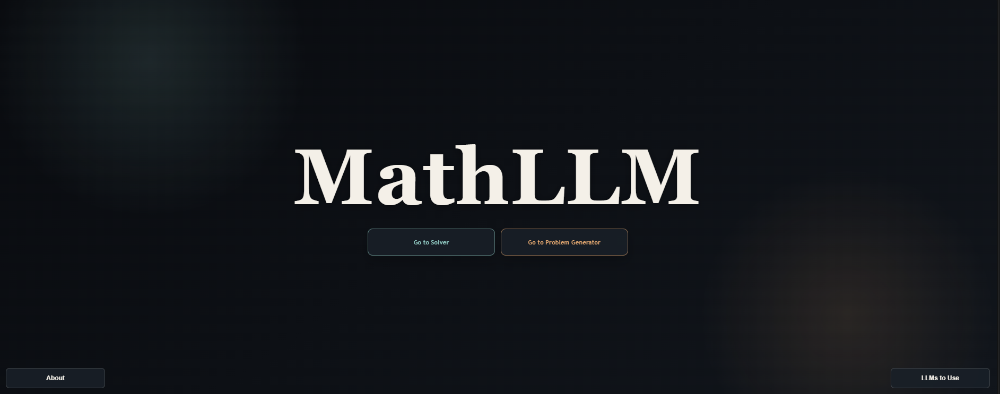

# MathLLM

An AI-powered mathematics assistant built with Django to help users generate, solve, and explore math problems with the support of AI agents.

## Table of Contents

- [Overview](#overview)
- [Features](#features)
- [Screenshots](#screenshots)
- [Tech Stack](#tech-stack)
- [Project Structure](#project-structure)
- [Installation](#installation)
- [Running the App](#running-the-app)
- [Usage](#usage)
- [Contributing](#contributing)
- [License](#license)

## Overview

MathLLM is a web application designed to assist students and math enthusiasts with AI-driven problem generation and solving. The app combines a Django backend with an interactive frontend to provide an easy-to-use experience for generating practice questions, solving math problems, and exploring AI-assisted learning tools.

This project is ideal for:

- Generating custom math exercises
- Solving mathematical problems with AI assistance
- Building educational tools powered by LLMs
- Learning how to combine Django, AI APIs, and web interfaces

## Features

- AI-assisted math problem generation
- Problem solving support with LLM integration
- Multiple app pages for different learning workflows
- Clean, responsive web design
- Django-based backend architecture
- Custom prompts for math-related tasks

## Screenshots

> Add your website screenshots in the folder `docs/images/` and update the image paths below.

### Homepage



### Problem Generator


### Solver Page


### About / Additional Page


### Optional: Dashboard or Feature Overview


## Tech Stack

- Python
- Django
- SQLite
- Ollama
- Pillow
- HTML / CSS / JavaScript

## Project Structure

```text
Math-LLM/
├── mainapp/
│   ├── static/
│   │   └── mainapp/
│   ├── templates/
│   │   └── mainapp/
│   ├── migrations/
│   ├── admin.py
│   ├── apps.py
│   ├── models.py
│   ├── tests.py
│   ├── urls.py
│   └── views.py
├── mathllm/
│   ├── __init__.py
│   ├── asgi.py
│   ├── settings.py
│   ├── urls.py
│   └── wsgi.py
├── prompts/
│   ├── generator.txt
│   └── solver.txt
├── utility_scripts/
│   ├── image_partitioning.py
│   └── llm.py
├── db.sqlite3
├── manage.py
├── pyproject.toml
├── README.md
└── docs/
    └── images/
```

## Installation

1. Clone the repository:

```bash
git clone https://github.com/your-username/Math-LLM.git
cd Math-LLM
```

2. Create and activate a virtual environment:

```bash
python -m venv .venv
source .venv/bin/activate
```

On Windows:

```bash
.venv\Scripts\activate
```

3. Install dependencies:

```bash
pip install -r requirements.txt
```

If you are using the project configuration defined in `pyproject.toml`, you can also install using:

```bash
pip install .
```

4. Apply database migrations:

```bash
python manage.py migrate
```

## Running the App

Start the Django development server:

```bash
python manage.py runserver
```

Then open the app in your browser:

```text
http://127.0.0.1:8000/
```

## Usage

1. Open the main application in your browser.
2. Navigate to the problem generator page to create math questions.
3. Use the solver page to submit a problem for AI-assisted reasoning.
4. Explore other pages such as about or feature sections to learn more about the project.
5. Customize prompts in the `prompts/` directory to tailor AI behavior.

## Contributing

Contributions are welcome.

1. Fork the repository
2. Create a feature branch
3. Make your changes
4. Commit and push your work
5. Open a pull request

## License

This project is currently unlicensed. If you intend to publish it publicly, consider adding a license such as MIT or Apache 2.0.

---

Created for the MathLLM project.
